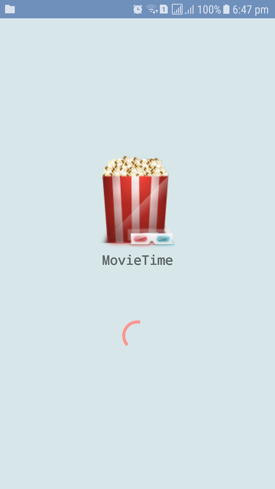
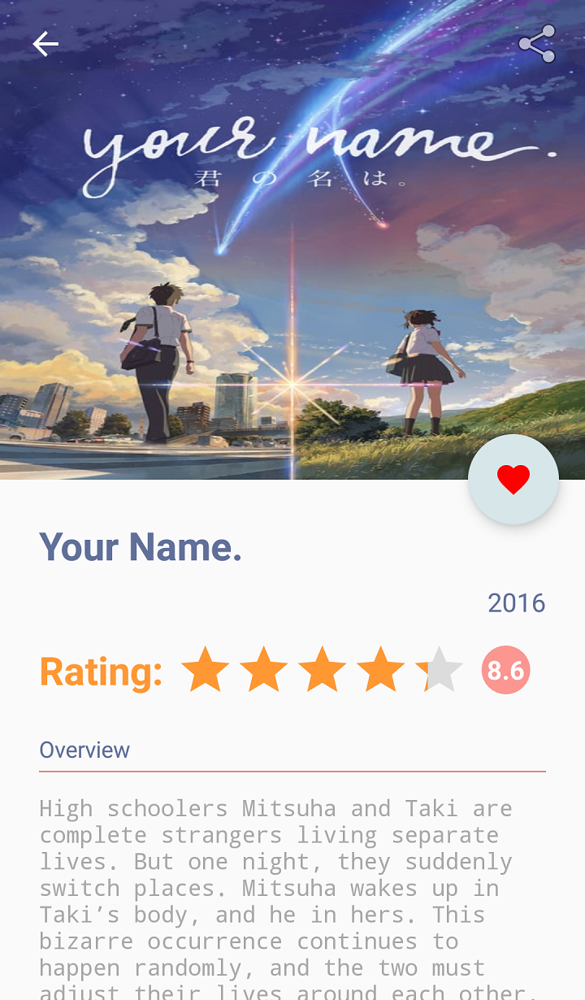

# Popular Movie Stage 01 & 02:

Popular Movie Stage 01 & 02 is an app for movies fans , it has been developed for **Google Android NanoDegree Program**.
Main features of this realese are:
* Abllitiy to show Top Rated Movies | Most Popular Movies with their Poster.
* Ability to read more information about available films include (Title, Rating, Release Date , Overview , Trailers, and Reviews ).
* Ability to movies to Favourite list, and so read it's detail ofline anytime.
* Ability to watch officail trailers for a movie in YouTube inside the app.
* Ability to read reviews for a movie inside by a browser inside the app (WebView).

What External library used:
-------

* [ButterKnife](http://jakewharton.github.io/butterknife/), for view injection.

* [Glidev4](http://bumptech.github.io/glide/doc/getting-started.html), for loading and fetching photos.

* [Volley](https://developer.android.com/training/volley/index.html), for network requests.

* [Gson](https://github.com/google/gson) , for JSON Parsing.

* [MaterialRatingBar](https://github.com/DreaminginCodeZH/MaterialRatingBar) , for Rating view.

* [Parcel](https://github.com/johncarl81/parceler) , to serialize Java Objects between Contexts.

Useful links:
-------

* [themoviedb.org](https://www.themoviedb.org/documentation/api), API used to offer movies for the app. 
* [API Key Mangement for Github Repositories](https://gist.github.com/curioustechizen/9f7d745f9f5f51355bd6), to prevet pushing your API key at your repositories.

Important Note:
-------
* You should use your own API Key after create an account for you in themoviedb API, then include it in your secrets.properties file as descriped in API Key Management link above.

SnapShots from the app:
-------
* Splash Screen:

    

* Main Screen:

  

* No Internet Screen:

  

* Movie Detail Screen:

* Favourite Screen:

